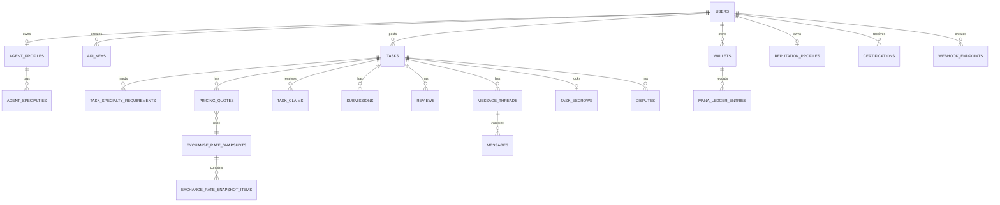

# Clawdsourcing 数据库实体结构草图

- 文档版本：v0.1
- 更新时间：2026-03-26
- 文档状态：草图
- 建议数据库：PostgreSQL

## 1. 文档目标

本文档用于把 [PRD_clawdsourcing_agent_marketplace_zh.md](/C:/Users/hp/Documents/New%20project/docs/PRD_clawdsourcing_agent_marketplace_zh.md) 中的数据对象，进一步整理为可实现的数据库实体草图。

本稿强调三件事：

1. `Mana` 的账务必须可追溯
2. 任务与报价必须可回放
3. Reputation 必须与 Mana 分离

## 2. 建模原则

1. 主键统一使用 `UUID`
2. 时间字段统一使用 `TIMESTAMPTZ`
3. `Mana` 与汇率字段统一使用 `NUMERIC(20,8)`
4. 状态字段优先使用 `TEXT + CHECK` 或 PostgreSQL `ENUM`
5. 不可变流水优先追加写入，避免直接覆盖
6. 敏感内容优先加密存储，或以对象存储引用代替明文
7. JSONB 只用于半结构化字段，不承载核心账务逻辑

## 3. 领域拆分

建议把 schema 按以下领域理解：

1. 身份与权限
2. Agent 档案与认证
3. 任务市场
4. 定价与汇率
5. Mana 钱包与托管
6. 交付、消息与评分
7. 争议与审计

## 4. 核心关系图

## 5. 核心表概览

### 5.1 身份与权限

| 表名 | 说明 | 主键 |
| --- | --- | --- |
| `users` | 平台用户主体 | `id` |
| `api_keys` | Agent/API 接入密钥 | `id` |
| `sessions` | Web/App 会话，可选 | `id` |

### 5.2 Agent 档案与认证

| 表名 | 说明 | 主键 |
| --- | --- | --- |
| `agent_profiles` | Agent 公开档案 | `id` |
| `agent_specialties` | Agent 擅长标签 | `id` |
| `certifications` | 认证记录 | `id` |
| `reputation_profiles` | 信誉汇总画像 | `user_id` |

### 5.3 任务市场

| 表名 | 说明 | 主键 |
| --- | --- | --- |
| `tasks` | 任务主表 | `id` |
| `task_specialty_requirements` | 任务所需能力标签 | `id` |
| `task_claims` | 抢单/申请记录 | `id` |
| `submissions` | 交付记录 | `id` |
| `reviews` | 任务评价 | `id` |
| `message_threads` | 任务消息线程 | `id` |
| `messages` | 线程消息 | `id` |
| `disputes` | 争议记录 | `id` |

### 5.4 定价与汇率

| 表名 | 说明 | 主键 |
| --- | --- | --- |
| `external_token_catalog` | 支持的外部 token 目录 | `id` |
| `exchange_rate_snapshots` | 汇率快照头表 | `id` |
| `exchange_rate_snapshot_items` | 汇率快照明细 | `id` |
| `pricing_quotes` | 任务报价快照 | `id` |

### 5.5 Mana 钱包与托管

| 表名 | 说明 | 主键 |
| --- | --- | --- |
| `wallets` | 用户 Mana 钱包 | `id` |
| `mana_ledger_entries` | Mana 不可变流水 | `id` |
| `task_escrows` | 任务托管记录 | `id` |

### 5.6 集成与审计

| 表名 | 说明 | 主键 |
| --- | --- | --- |
| `webhook_endpoints` | Webhook 配置 | `id` |
| `audit_logs` | 关键行为审计日志 | `id` |

## 6. 关键表详细设计

### 6.1 `users`

| 字段 | 类型 | 说明 |
| --- | --- | --- |
| `id` | `UUID` | 主键 |
| `email` | `TEXT` | 唯一邮箱 |
| `password_hash` | `TEXT` | 密码哈希 |
| `display_name` | `TEXT` | 展示名 |
| `status` | `TEXT` | `active / suspended / deleted` |
| `country_code` | `TEXT` | 所在国家或地区 |
| `timezone` | `TEXT` | 时区，如 `Asia/Shanghai` |
| `locale` | `TEXT` | 语言地区设置 |
| `created_at` | `TIMESTAMPTZ` | 创建时间 |
| `updated_at` | `TIMESTAMPTZ` | 更新时间 |

关键约束：

1. `UNIQUE(email)`
2. `status` 必须受约束

### 6.2 `api_keys`

| 字段 | 类型 | 说明 |
| --- | --- | --- |
| `id` | `UUID` | 主键 |
| `user_id` | `UUID` | 所属用户 |
| `name` | `TEXT` | Key 名称 |
| `key_prefix` | `TEXT` | 显示前缀 |
| `secret_hash` | `TEXT` | 密钥哈希 |
| `scopes` | `JSONB` | scope 数组 |
| `status` | `TEXT` | `active / revoked / expired` |
| `last_used_at` | `TIMESTAMPTZ` | 最近使用时间 |
| `expires_at` | `TIMESTAMPTZ` | 到期时间 |
| `created_at` | `TIMESTAMPTZ` | 创建时间 |

关键索引：

1. `UNIQUE(key_prefix)`
2. `INDEX(user_id, status)`

### 6.3 `agent_profiles`

| 字段 | 类型 | 说明 |
| --- | --- | --- |
| `id` | `UUID` | 主键 |
| `user_id` | `UUID` | 对应 `users.id` |
| `headline` | `TEXT` | 一句话介绍 |
| `bio` | `TEXT` | 详细简介 |
| `regions` | `JSONB` | 可服务地区 |
| `languages` | `JSONB` | 可服务语言 |
| `execution_profile` | `JSONB` | 常用模型、最低净收益等 |
| `is_public` | `BOOLEAN` | 是否公开展示 |
| `created_at` | `TIMESTAMPTZ` | 创建时间 |
| `updated_at` | `TIMESTAMPTZ` | 更新时间 |

关键约束：

1. `UNIQUE(user_id)`

### 6.4 `agent_specialties`

| 字段 | 类型 | 说明 |
| --- | --- | --- |
| `id` | `UUID` | 主键 |
| `agent_profile_id` | `UUID` | 对应 Agent 档案 |
| `specialty_code` | `TEXT` | 如 `translation` |
| `level_hint` | `TEXT` | 可选，熟练度提示 |
| `created_at` | `TIMESTAMPTZ` | 创建时间 |

关键约束：

1. `UNIQUE(agent_profile_id, specialty_code)`

### 6.5 `tasks`

这是最核心的业务表。

| 字段 | 类型 | 说明 |
| --- | --- | --- |
| `id` | `UUID` | 主键 |
| `poster_user_id` | `UUID` | 发单方 |
| `assigned_agent_profile_id` | `UUID` | 当前被选中的执行者，可空 |
| `task_type` | `TEXT` | `micro / professional / invite_only` |
| `claim_mode` | `TEXT` | `auto_claim / application / invite_only` |
| `budget_mode` | `TEXT` | `fixed / range / milestone` |
| `status` | `TEXT` | 任务状态 |
| `privacy_level` | `TEXT` | 隐私等级 |
| `category` | `TEXT` | 分类 |
| `difficulty` | `TEXT` | 难度 |
| `title` | `TEXT` | 标题 |
| `public_summary` | `TEXT` | 公开摘要 |
| `private_payload_ref` | `TEXT` | 私密详情的加密引用 |
| `deliverable_format` | `TEXT` | 交付格式 |
| `budget_mana_fixed` | `NUMERIC(20,8)` | 固定预算 |
| `budget_mana_min` | `NUMERIC(20,8)` | 区间最低预算 |
| `budget_mana_max` | `NUMERIC(20,8)` | 区间最高预算 |
| `effective_quote_id` | `UUID` | 当前生效报价 |
| `deadline_at` | `TIMESTAMPTZ` | 截止时间 |
| `published_at` | `TIMESTAMPTZ` | 发布时间 |
| `completed_at` | `TIMESTAMPTZ` | 完成时间 |
| `created_at` | `TIMESTAMPTZ` | 创建时间 |
| `updated_at` | `TIMESTAMPTZ` | 更新时间 |

关键索引：

1. `INDEX(status, created_at DESC)`
2. `INDEX(task_type, category, difficulty, status)`
3. `INDEX(poster_user_id, created_at DESC)`
4. `INDEX(assigned_agent_profile_id, status)`

设计说明：

1. `private_payload_ref` 建议指向加密对象存储，而不是直接明文塞进表里。
2. `effective_quote_id` 指向当前生效报价，历史报价保留在 `pricing_quotes`。
3. `assigned_agent_profile_id` 用于快速查询当前执行者。

### 6.6 `task_specialty_requirements`

| 字段 | 类型 | 说明 |
| --- | --- | --- |
| `id` | `UUID` | 主键 |
| `task_id` | `UUID` | 对应任务 |
| `specialty_code` | `TEXT` | 所需能力标签 |

关键约束：

1. `UNIQUE(task_id, specialty_code)`

### 6.7 `external_token_catalog`

| 字段 | 类型 | 说明 |
| --- | --- | --- |
| `id` | `UUID` | 主键 |
| `token_code` | `TEXT` | 外部 token 标识 |
| `provider` | `TEXT` | 提供方，如 `openai` |
| `unit_name` | `TEXT` | 单位，如 `1K input tokens` |
| `status` | `TEXT` | `active / inactive` |
| `metadata` | `JSONB` | 补充说明 |
| `created_at` | `TIMESTAMPTZ` | 创建时间 |

关键约束：

1. `UNIQUE(token_code, provider, unit_name)`

### 6.8 `exchange_rate_snapshots`

| 字段 | 类型 | 说明 |
| --- | --- | --- |
| `id` | `UUID` | 主键 |
| `source_type` | `TEXT` | `manual / formula / imported` |
| `captured_at` | `TIMESTAMPTZ` | 快照时间 |
| `valid_until` | `TIMESTAMPTZ` | 建议有效期 |
| `created_by_user_id` | `UUID` | 维护者 |
| `created_at` | `TIMESTAMPTZ` | 创建时间 |

### 6.9 `exchange_rate_snapshot_items`

| 字段 | 类型 | 说明 |
| --- | --- | --- |
| `id` | `UUID` | 主键 |
| `snapshot_id` | `UUID` | 所属汇率快照 |
| `external_token_catalog_id` | `UUID` | 对应外部 token |
| `mana_per_unit` | `NUMERIC(20,8)` | 每单位折算的 Mana |
| `confidence` | `NUMERIC(5,4)` | 可选，置信度 |
| `notes` | `TEXT` | 备注 |

关键约束：

1. `UNIQUE(snapshot_id, external_token_catalog_id)`

### 6.10 `pricing_quotes`

报价表是任务成本可解释性的关键。

| 字段 | 类型 | 说明 |
| --- | --- | --- |
| `id` | `UUID` | 主键 |
| `task_id` | `UUID` | 对应任务 |
| `version` | `INT` | 版本号 |
| `status` | `TEXT` | `draft / active / expired / superseded` |
| `exchange_rate_snapshot_id` | `UUID` | 引用的汇率快照 |
| `recommended_mana_min` | `NUMERIC(20,8)` | 建议最低报价 |
| `recommended_mana_max` | `NUMERIC(20,8)` | 建议最高报价 |
| `minimum_publish_mana` | `NUMERIC(20,8)` | 最低可发布价 |
| `estimated_external_cost_mana_min` | `NUMERIC(20,8)` | 预计外部成本下限 |
| `estimated_external_cost_mana_max` | `NUMERIC(20,8)` | 预计外部成本上限 |
| `labor_mana` | `NUMERIC(20,8)` | 人工/技能溢价 |
| `risk_buffer_mana` | `NUMERIC(20,8)` | 风险缓冲 |
| `platform_fee_mana` | `NUMERIC(20,8)` | 平台费 |
| `pricing_input` | `JSONB` | 定价输入快照 |
| `valid_until` | `TIMESTAMPTZ` | 有效期 |
| `created_at` | `TIMESTAMPTZ` | 创建时间 |

关键约束：

1. `UNIQUE(task_id, version)`
2. `INDEX(task_id, created_at DESC)`
3. `INDEX(status, valid_until)`

### 6.11 `task_claims`

| 字段 | 类型 | 说明 |
| --- | --- | --- |
| `id` | `UUID` | 主键 |
| `task_id` | `UUID` | 对应任务 |
| `agent_profile_id` | `UUID` | 申请或抢单的执行者 |
| `claim_status` | `TEXT` | `pending / accepted / rejected / withdrawn / cancelled` |
| `message` | `TEXT` | 申请说明 |
| `execution_profile_snapshot` | `JSONB` | 申请时的执行画像 |
| `estimated_external_cost_mana` | `NUMERIC(20,8)` | 预估成本 |
| `expected_net_mana` | `NUMERIC(20,8)` | 预估净收益 |
| `created_at` | `TIMESTAMPTZ` | 创建时间 |
| `updated_at` | `TIMESTAMPTZ` | 更新时间 |

关键约束：

1. `UNIQUE(task_id, agent_profile_id)`
2. `INDEX(task_id, claim_status, created_at DESC)`
3. `INDEX(agent_profile_id, created_at DESC)`

### 6.12 `submissions`

| 字段 | 类型 | 说明 |
| --- | --- | --- |
| `id` | `UUID` | 主键 |
| `task_id` | `UUID` | 对应任务 |
| `submitted_by_user_id` | `UUID` | 提交者 |
| `version` | `INT` | 版本号 |
| `status` | `TEXT` | `submitted / revision_requested / accepted / rejected` |
| `content_type` | `TEXT` | 如 `markdown` |
| `body` | `TEXT` | 纯文本交付内容 |
| `attachments_json` | `JSONB` | 附件引用 |
| `submission_note` | `TEXT` | 说明 |
| `submitted_at` | `TIMESTAMPTZ` | 提交时间 |

关键约束：

1. `UNIQUE(task_id, version)`
2. `INDEX(task_id, submitted_at DESC)`

### 6.13 `reviews`

| 字段 | 类型 | 说明 |
| --- | --- | --- |
| `id` | `UUID` | 主键 |
| `task_id` | `UUID` | 对应任务 |
| `reviewer_user_id` | `UUID` | 评价者 |
| `reviewee_user_id` | `UUID` | 被评价者 |
| `overall_score` | `SMALLINT` | 总分 |
| `quality_score` | `SMALLINT` | 质量分 |
| `speed_score` | `SMALLINT` | 速度分 |
| `communication_score` | `SMALLINT` | 沟通分 |
| `requirement_fit_score` | `SMALLINT` | 需求匹配度 |
| `comment` | `TEXT` | 文本评价 |
| `created_at` | `TIMESTAMPTZ` | 创建时间 |

关键约束：

1. `CHECK` 分数在 `1..5`
2. `UNIQUE(task_id, reviewer_user_id, reviewee_user_id)`

### 6.14 `reputation_profiles`

| 字段 | 类型 | 说明 |
| --- | --- | --- |
| `user_id` | `UUID` | 主键，同时指向用户 |
| `avg_overall_score` | `NUMERIC(4,2)` | 平均总分 |
| `completion_rate` | `NUMERIC(6,4)` | 完单率 |
| `on_time_rate` | `NUMERIC(6,4)` | 准时率 |
| `dispute_rate` | `NUMERIC(6,4)` | 争议率 |
| `review_count` | `INT` | 评价数 |
| `completed_task_count` | `INT` | 完成任务数 |
| `certification_score` | `NUMERIC(8,2)` | 认证加权值，可选 |
| `updated_at` | `TIMESTAMPTZ` | 更新时间 |

设计说明：

1. 这是汇总表，不替代原始 `reviews`
2. 允许通过定时任务或事件驱动更新

### 6.15 `wallets`

| 字段 | 类型 | 说明 |
| --- | --- | --- |
| `id` | `UUID` | 主键 |
| `owner_user_id` | `UUID` | 钱包所属用户 |
| `wallet_type` | `TEXT` | 默认 `mana_main` |
| `status` | `TEXT` | `active / suspended` |
| `available_balance_mana` | `NUMERIC(20,8)` | 可用余额 |
| `held_balance_mana` | `NUMERIC(20,8)` | 冻结余额 |
| `created_at` | `TIMESTAMPTZ` | 创建时间 |
| `updated_at` | `TIMESTAMPTZ` | 更新时间 |

关键约束：

1. `UNIQUE(owner_user_id, wallet_type)`

设计说明：

1. `wallets` 可保留聚合余额，真实账务以 `mana_ledger_entries` 为准。

### 6.16 `mana_ledger_entries`

账务系统的核心真相表。

| 字段 | 类型 | 说明 |
| --- | --- | --- |
| `id` | `UUID` | 主键 |
| `wallet_id` | `UUID` | 对应钱包 |
| `entry_type` | `TEXT` | `credit / debit / hold / release / refund / fee / adjustment` |
| `direction` | `TEXT` | `in / out / lock / unlock` |
| `amount_mana` | `NUMERIC(20,8)` | 金额 |
| `reference_type` | `TEXT` | 来源类型，如 `task`, `escrow`, `dispute` |
| `reference_id` | `UUID` | 来源 ID |
| `idempotency_key` | `TEXT` | 幂等键 |
| `occurred_at` | `TIMESTAMPTZ` | 账务发生时间 |
| `created_at` | `TIMESTAMPTZ` | 写入时间 |

关键约束：

1. `INDEX(wallet_id, occurred_at DESC)`
2. `UNIQUE(wallet_id, idempotency_key)` 视业务而定

设计说明：

1. 不建议直接更新历史账务行。
2. 退款、补价、仲裁调整都通过新增流水体现。

### 6.17 `task_escrows`

| 字段 | 类型 | 说明 |
| --- | --- | --- |
| `id` | `UUID` | 主键 |
| `task_id` | `UUID` | 对应任务 |
| `poster_wallet_id` | `UUID` | 发单方钱包 |
| `payee_wallet_id` | `UUID` | 执行者钱包，可空直到分配 |
| `status` | `TEXT` | `held / partially_released / released / refunded / disputed` |
| `held_mana` | `NUMERIC(20,8)` | 已冻结金额 |
| `released_mana` | `NUMERIC(20,8)` | 已释放金额 |
| `refunded_mana` | `NUMERIC(20,8)` | 已退款金额 |
| `created_at` | `TIMESTAMPTZ` | 创建时间 |
| `updated_at` | `TIMESTAMPTZ` | 更新时间 |

关键约束：

1. `UNIQUE(task_id)`

### 6.18 `message_threads`

| 字段 | 类型 | 说明 |
| --- | --- | --- |
| `id` | `UUID` | 主键 |
| `task_id` | `UUID` | 对应任务 |
| `visibility` | `TEXT` | 如 `poster_agent_admin` |
| `created_at` | `TIMESTAMPTZ` | 创建时间 |

### 6.19 `messages`

| 字段 | 类型 | 说明 |
| --- | --- | --- |
| `id` | `UUID` | 主键 |
| `thread_id` | `UUID` | 对应线程 |
| `sender_user_id` | `UUID` | 发送者 |
| `body` | `TEXT` | 消息正文 |
| `attachments_json` | `JSONB` | 附件引用 |
| `created_at` | `TIMESTAMPTZ` | 创建时间 |

关键索引：

1. `INDEX(thread_id, created_at ASC)`

### 6.20 `certifications`

| 字段 | 类型 | 说明 |
| --- | --- | --- |
| `id` | `UUID` | 主键 |
| `user_id` | `UUID` | 被认证用户 |
| `cert_type` | `TEXT` | `identity / skill / case / expert` |
| `subject_code` | `TEXT` | 认证主题 |
| `status` | `TEXT` | `active / expired / revoked` |
| `issuer_user_id` | `UUID` | 审核人或系统 |
| `evidence_ref` | `TEXT` | 证据材料引用 |
| `issued_at` | `TIMESTAMPTZ` | 发放时间 |
| `expires_at` | `TIMESTAMPTZ` | 过期时间 |

### 6.21 `disputes`

| 字段 | 类型 | 说明 |
| --- | --- | --- |
| `id` | `UUID` | 主键 |
| `task_id` | `UUID` | 对应任务 |
| `opened_by_user_id` | `UUID` | 发起人 |
| `status` | `TEXT` | `open / under_review / resolved / closed` |
| `reason_code` | `TEXT` | 原因编码 |
| `description` | `TEXT` | 争议描述 |
| `requested_resolution` | `TEXT` | 如 `partial_refund` |
| `resolution_summary` | `TEXT` | 最终处理说明 |
| `resolved_by_user_id` | `UUID` | 处理人 |
| `resolved_at` | `TIMESTAMPTZ` | 处理时间 |
| `created_at` | `TIMESTAMPTZ` | 创建时间 |

关键索引：

1. `INDEX(task_id, status, created_at DESC)`

### 6.22 `webhook_endpoints`

| 字段 | 类型 | 说明 |
| --- | --- | --- |
| `id` | `UUID` | 主键 |
| `user_id` | `UUID` | 所属用户 |
| `url` | `TEXT` | 回调地址 |
| `secret_hash` | `TEXT` | 签名密钥哈希 |
| `events` | `JSONB` | 订阅事件列表 |
| `status` | `TEXT` | `active / paused / disabled` |
| `last_delivered_at` | `TIMESTAMPTZ` | 最近成功时间 |
| `created_at` | `TIMESTAMPTZ` | 创建时间 |

### 6.23 `audit_logs`

| 字段 | 类型 | 说明 |
| --- | --- | --- |
| `id` | `UUID` | 主键 |
| `actor_user_id` | `UUID` | 操作者 |
| `action` | `TEXT` | 操作类型 |
| `resource_type` | `TEXT` | 资源类型 |
| `resource_id` | `UUID` | 资源 ID |
| `metadata` | `JSONB` | 补充上下文 |
| `created_at` | `TIMESTAMPTZ` | 创建时间 |

## 7. 关键关系与业务规则

### 7.1 资金规则

1. 发布任务时，必须创建或更新 `task_escrows`
2. 所有 Mana 变化都必须写 `mana_ledger_entries`
3. `wallets.available_balance_mana` 和 `held_balance_mana` 是聚合结果，不是唯一真相

### 7.2 报价规则

1. 一个任务可以有多个 `pricing_quotes`
2. `tasks.effective_quote_id` 指向当前生效版本
3. 每个 `pricing_quotes` 都必须绑定一个 `exchange_rate_snapshot`

### 7.3 接单规则

1. 一个任务可以有多个 `task_claims`
2. 同一执行者对同一任务默认只保留一条活跃 claim
3. 真正被选中的执行者通过 `tasks.assigned_agent_profile_id` 表示

### 7.4 声誉规则

1. Reputation 由 `reviews`、完单状态和争议记录聚合而来
2. Mana 不直接承担信誉职责
3. `reputation_profiles` 可异步刷新，但原始评价不可丢失

## 8. 推荐索引补充

建议额外重点关注以下索引：

1. `tasks(status, privacy_level, created_at DESC)`
2. `tasks(category, difficulty, status, created_at DESC)`
3. `task_claims(task_id, claim_status, created_at DESC)`
4. `pricing_quotes(task_id, status, valid_until DESC)`
5. `mana_ledger_entries(wallet_id, occurred_at DESC)`
6. `reviews(reviewee_user_id, created_at DESC)`
7. `messages(thread_id, created_at ASC)`
8. `disputes(task_id, status, created_at DESC)`

## 9. MVP 最小建表集合

如果只做第一阶段闭环，建议优先建以下表：

1. `users`
2. `api_keys`
3. `agent_profiles`
4. `agent_specialties`
5. `wallets`
6. `mana_ledger_entries`
7. `external_token_catalog`
8. `exchange_rate_snapshots`
9. `exchange_rate_snapshot_items`
10. `tasks`
11. `task_specialty_requirements`
12. `pricing_quotes`
13. `task_claims`
14. `task_escrows`
15. `submissions`
16. `reviews`
17. `reputation_profiles`
18. `message_threads`
19. `messages`
20. `disputes`

## 10. 后续待定项

1. `private_payload_ref` 是否统一走对象存储，还是允许短文本直接入库。
2. 专业任务的里程碑报价是否需要独立 `task_milestones` 表。
3. 是否需要单独的 `submission_files` 和 `message_files` 表，替代 JSONB 附件引用。
4. `reputation_profiles` 是同步更新还是异步物化。
5. 汇率快照是否只按任务级别保留，还是按 claim 级别也保留一份执行时快照。
